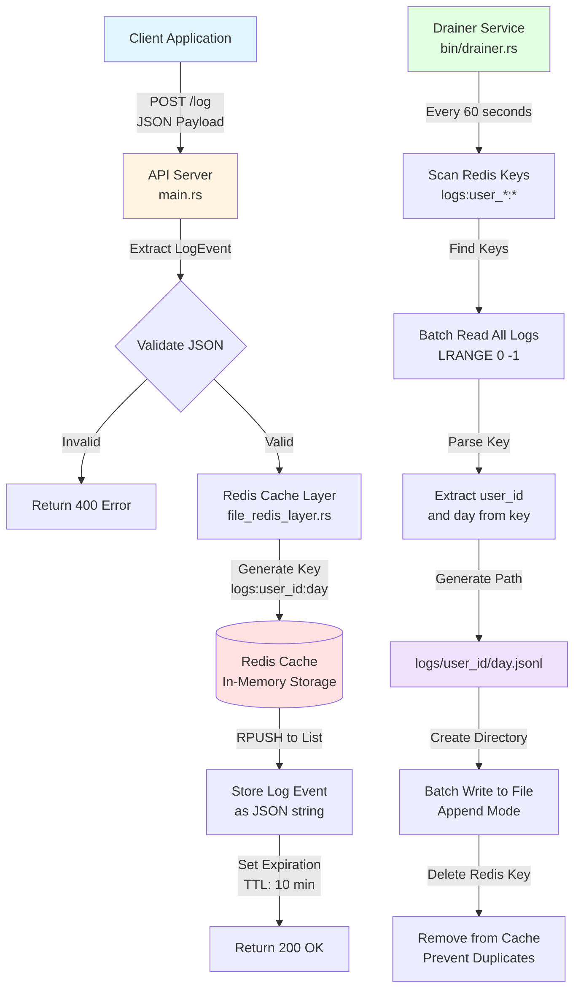
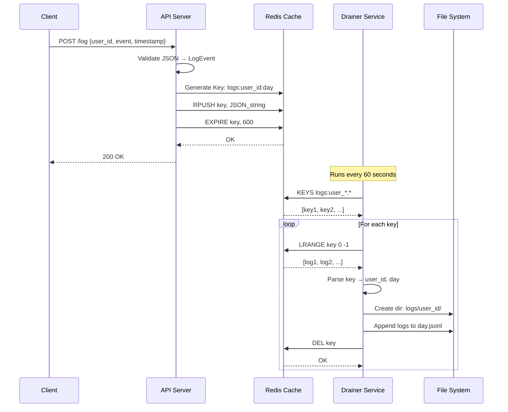
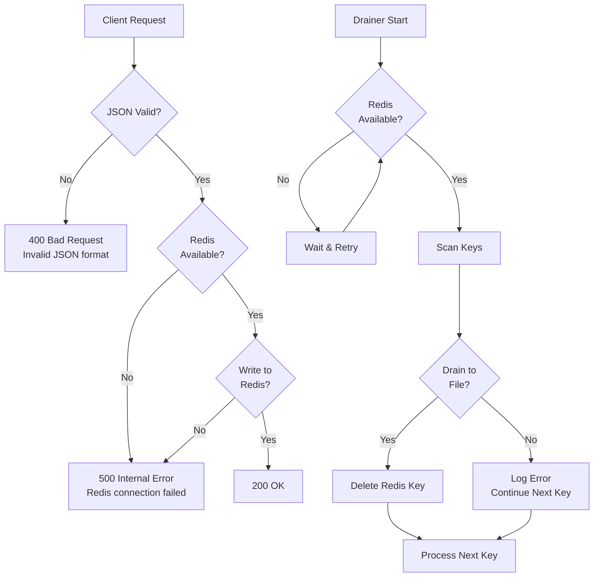

# Log Pipeline Flow Diagram

## Architecture Flow



## Detailed Step-by-Step Flow

### 1. Log Ingestion Flow

```
┌─────────────┐
│   Client    │
└──────┬──────┘
       │ POST /log
       │ {
       │   "user_id": "123",
       │   "event": "clicked_button",
       │   "timestamp": 1712345678
       │ }
       ▼
┌─────────────────┐
│  API Server     │
│  (main.rs)      │
└──────┬──────────┘
       │
       │ 1. Parse JSON → LogEvent struct
       │ 2. Validate fields (type-safe)
       ▼
┌─────────────────┐
│ Redis Layer     │
│ (file_redis_    │
│  layer.rs)      │
└──────┬──────────┘
       │
       │ 1. Generate Redis Key:
       │    logs:user_123:19847
       │    (user_id + days_since_epoch)
       │
       │ 2. Serialize to JSON string
       │
       │ 3. RPUSH to Redis list
       │
       │ 4. Set expiration (600s)
       ▼
┌─────────────────┐
│   Redis Cache   │
│                 │
│ Key: logs:user_ │
│      123:19847  │
│                 │
│ List:           │
│ [0] {"user_id": │
│      "123",...} │
│ [1] {"user_id": │
│      "123",...} │
│ ...             │
└─────────────────┘
       │
       │ Return 200 OK
       ▼
┌─────────────┐
│   Client     │
│ (Success)    │
└─────────────┘
```

### 2. Drainer Flow

```
┌─────────────────┐
│  Drainer       │
│  Service       │
│  (bin/drainer) │
└──────┬──────────┘
       │
       │ Every 60 seconds (configurable)
       │
       ▼
┌─────────────────┐
│  Scan Redis     │
│  KEYS           │
│  logs:user_*:*  │
└──────┬──────────┘
       │
       │ Found: [
       │   "logs:user_123:19847",
       │   "logs:user_456:19847",
       │   ...
       │ ]
       ▼
┌─────────────────┐
│  For Each Key   │
└──────┬──────────┘
       │
       │ 1. LRANGE key 0 -1
       │    (Get all logs)
       │
       │ 2. Parse key:
       │    logs:user_123:19847
       │    → user_id: "123"
       │    → day: "19847"
       │
       │ 3. Generate file path:
       │    logs/user_123/19847.jsonl
       ▼
┌─────────────────┐
│  File System    │
│                 │
│ logs/           │
│   user_123/     │
│     19847.jsonl │
│   user_456/     │
│     19847.jsonl │
└──────┬──────────┘
       │
       │ 1. Create directory if needed
       │ 2. Open file (append mode)
       │ 3. Write all logs (batch)
       │ 4. Close file
       │
       ▼
┌─────────────────┐
│  Cleanup Redis  │
│  DEL key         │
│  (Prevent        │
│   duplicates)    │
└─────────────────┘
```

## Data Flow

### Key Generation

```
LogEvent {
  user_id: "123"
  timestamp: 1712345678
}
         │
         ▼
days = timestamp / 86400
     = 1712345678 / 86400
     = 19847
         │
         ▼
Redis Key: "logs:user_123:19847"
File Path: "logs/user_123/19847.jsonl"
```

### Redis Data Structure

```
Redis Key: logs:user_123:19847
Type: LIST
TTL: 600 seconds (10 minutes)

Values:
[0] {"user_id":"123","event":"clicked_button","timestamp":1712345678}
[1] {"user_id":"123","event":"login","timestamp":1712345680}
[2] {"user_id":"123","event":"viewed_page","timestamp":1712345690}
...
```

### File System Structure

```
logs/
├── user_123/
│   ├── 19847.jsonl  (Day 19847)
│   └── 19848.jsonl  (Day 19848)
├── user_456/
│   ├── 19847.jsonl
│   └── 19848.jsonl
└── user_789/
    └── 19847.jsonl
```

## Sequence Diagram



## Error Handling Flow



## Configuration Flow

```
config.toml
    │
    ├── [server]
    │   ├── host: "127.0.0.1"
    │   └── port: 3000
    │
    ├── [redis]
    │   ├── url: "redis://127.0.0.1:6379"
    │   └── key_expiration_seconds: 600
    │
    └── [drainer]
        ├── interval_seconds: 60
        └── log_pattern: "logs:user_*:*"
            │
            ▼
    Loaded by Config::load()
            │
            ├──→ API Server (main.rs)
            └──→ Drainer Service (bin/drainer.rs)
```

## Complete System Flow

```
┌─────────────────────────────────────────────────────────┐
│                    LOG PIPELINE SYSTEM                   │
└─────────────────────────────────────────────────────────┘

1. INGESTION PATH (Fast - Microseconds)
   ┌──────────┐
   │  Client  │──POST /log──→┌──────────┐
   └──────────┘              │   API    │
                              │  Server  │
                              └────┬─────┘
                                   │
                                   ▼
                              ┌──────────┐
                              │  Redis   │
                              │  Cache   │
                              └──────────┘
                              (In-Memory)
                                   │
                                   │ Key: logs:user_id:day
                                   │ List: [log1, log2, ...]
                                   │ TTL: 600s

2. DRAIN PATH (Background - Every 60s)
                              ┌──────────┐
                              │  Redis   │
                              │  Cache   │
                              └────┬─────┘
                                   │
                                   │ Scan: logs:user_*:*
                                   ▼
                              ┌──────────┐
                              │ Drainer  │
                              │ Service  │
                              └────┬─────┘
                                   │
                                   │ Batch Read
                                   │ Parse Key
                                   │ Generate Path
                                   ▼
                              ┌──────────┐
                              │   File   │
                              │  System  │
                              └──────────┘
                              logs/user_id/day.jsonl
```

## Key Points

1. **Fast Writes**: Logs go to Redis first (in-memory, microseconds)
2. **Batch Draining**: Drainer processes multiple logs at once (efficient)
3. **User Isolation**: Each user gets separate files (no contention)
4. **Automatic Cleanup**: Redis keys deleted after draining (no duplicates)
5. **TTL Safety**: Keys expire after 10 minutes (prevents memory bloat)
6. **Separate Services**: API and Drainer can scale independently

